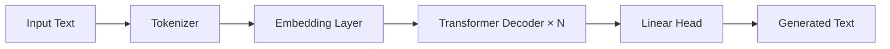

<div align="center">

# GPT From Scratch

### A Decoder-Only Transformer Language Model Implemented in PyTorch


A clean implementation of a GPT-style language model covering the complete pipeline from tokenization and attention mechanisms to pretraining, fine-tuning, and autoregressive text generation.

</div>

---

## Features

- Decoder-only GPT architecture
- Token & positional embeddings
- Multi-head causal self-attention
- Feed-forward networks
- Layer normalization & residual connections
- GPT pretraining
- Classification fine-tuning
- Instruction fine-tuning
- Autoregressive text generation

---

## Architecture



---

## Project Structure

```text
gpt-from-scratch/

├── src/
│   ├── model.py
│   ├── tokenizer.py
│   ├── dataset.py
│   ├── train.py
│   ├── generate.py
│   ├── classifier.py
│   ├── instruction_tuning.py
│   └── utils.py
│
├── examples/
├── checkpoints/
├── README.md
├── requirements.txt
└── LICENSE
```

---

## Installation

```bash
git clone https://github.com/<your-username>/gpt-from-scratch.git

cd gpt-from-scratch

pip install -r requirements.txt
```

---

## Usage

Train the model

```bash
python src/train.py
```

Generate text

```bash
python src/generate.py
```

Fine-tune for classification

```bash
python src/classifier.py
```

Instruction fine-tuning

```bash
python src/instruction_tuning.py
```

---

## Example

**Prompt**

```text
The future of artificial intelligence
```

**Generated Output**

```text
The future of artificial intelligence will continue to transform how humans interact with technology through increasingly capable language models...
```

---

## References

- Attention Is All You Need (2017)
- GPT-2: Language Models are Unsupervised Multitask Learners
- Sebastian Raschka — *Build a Large Language Model From Scratch*

---

## Acknowledgements

This project was built as an educational implementation of a GPT-style decoder-only Transformer using PyTorch.

---

## License

MIT License

