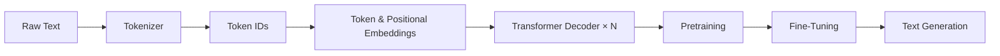

<div align="center">

# 🧠 GPT From Scratch

### A Decoder-Only Transformer Language Model in PyTorch

<p align="center">


</p>

An educational implementation of a **GPT-style decoder-only Transformer** in **PyTorch**, covering the complete pipeline from text processing and attention mechanisms to language model pretraining, fine-tuning, and autoregressive text generation.

</div>

---

## 📖 Overview

This repository implements the fundamental components required to build a GPT-style language model from scratch.

The implementation progresses through tokenization, attention mechanisms, Transformer decoder blocks, language model pretraining, and downstream fine-tuning, with each script focusing on a specific stage of the pipeline.

---

## ✨ Features

- ✅ Decoder-only Transformer architecture
- ✅ Token & positional embeddings
- ✅ Multi-head causal self-attention
- ✅ Feed-forward networks
- ✅ Residual connections & Layer Normalization
- ✅ GPT pretraining pipeline
- ✅ Classification fine-tuning
- ✅ Instruction fine-tuning
- ✅ Autoregressive text generation

---

## 📂 Repository Structure

| Script | Description |
|---------|-------------|
| `01-Working_with_Text_Data.py` | Text preprocessing, tokenization, chunking, and dataloaders |
| `02-Coding_Attention_Mechanisms.py` | Self-attention, causal attention, and multi-head attention |
| `03-Implementing_a_GPT_Model_from_Scratch.py` | GPT architecture, Transformer blocks, and text generation |
| `04-Pretraining_on_Unlabeled_Data.py` | Language model pretraining and evaluation |
| `05-Finetuning_for_Text_Classification.py` | Fine-tuning GPT for text classification |
| `06-Finetuning_to_Follow_Instructions.py` | Instruction fine-tuning and supervised learning |

---

## 🏗️ Implementation Pipeline



---

## 🚀 Getting Started

Install the required dependencies:

```bash
pip install -r requirements.txt
```

Run the scripts sequentially to follow the complete implementation pipeline:

```bash
python 01-Working_with_Text_Data.py

python 02-Coding_Attention_Mechanisms.py

python 03-Implementing_a_GPT_Model_from_Scratch.py

python 04-Pretraining_on_Unlabeled_Data.py

python 05-Finetuning_for_Text_Classification.py

python 06-Finetuning_to_Follow_Instructions.py
```

Each script can also be executed independently to explore a specific component of the implementation.

---

## 🧩 Topics Covered

- Tokenization & Data Loading
- Token & Positional Embeddings
- Self-Attention & Causal Attention
- Multi-Head Attention
- Transformer Decoder Blocks
- GPT Architecture
- Language Model Pretraining
- Classification Fine-Tuning
- Instruction Fine-Tuning
- Autoregressive Text Generation

---

## 📚 References

- Attention Is All You Need (2017)
- Language Models are Unsupervised Multitask Learners (GPT-2)

---